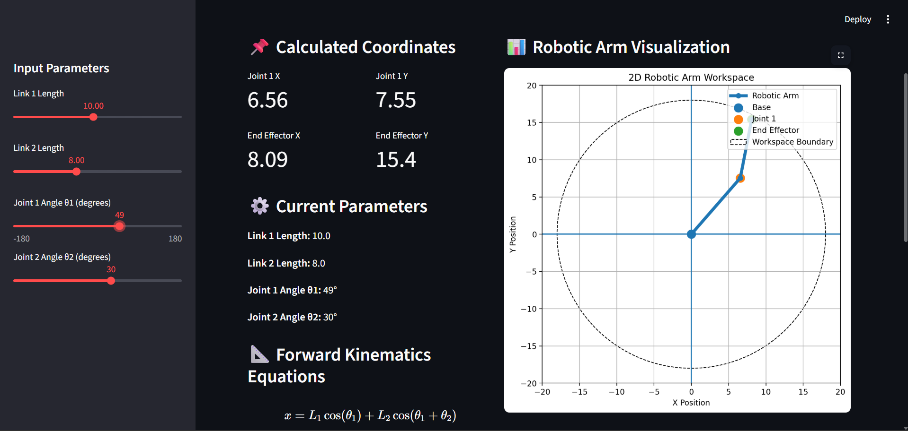

# 2D Robotic Arm Forward Kinematics Simulator

## Overview
This project is an interactive 2D robotic arm simulator developed using Python and Streamlit. It calculates and visualizes the end-effector position of a two-link robotic arm using forward kinematics.

The simulator allows users to change link lengths and joint angles using sliders and instantly observe how the robotic arm position changes.

## Features
- Interactive sliders for link lengths and joint angles
- Real-time robotic arm visualization
- End-effector coordinate calculation
- Joint coordinate calculation
- Workspace boundary visualization
- Forward kinematics equations
- Clean web-based dashboard using Streamlit

## Technologies Used
- Python
- Streamlit
- NumPy
- Matplotlib

## Forward Kinematics Equations

For a 2-link planar robotic arm:

x = L1*cos(theta1) + L2*cos(theta1 + theta2)

y = L1*sin(theta1) + L2*sin(theta1 + theta2)

Where:
- L1 = Length of Link 1
- L2 = Length of Link 2
- theta1 = Joint 1 angle
- theta2 = Joint 2 angle
- x, y = End-effector coordinates

## How to Run the Project

1. Clone or download this repository.

2. Install required libraries:

```bash
pip install -r requirements.txt
```

3. Run the Streamlit app:

```bash
python -m streamlit run app.py
```

4. Open the local URL in your browser:

```text
http://localhost:8501
```

## Applications
- Robotic arm motion analysis
- Pick-and-place robot simulation
- Industrial manipulator study
- Robot workspace visualization
- Motion planning basics
- Robotics education

## Future Improvements
- Add inverse kinematics
- Add 3-link robotic arm simulation
- Add animation between two positions
- Add obstacle avoidance in workspace
- Add pick-and-place path simulation

## Project Demo


